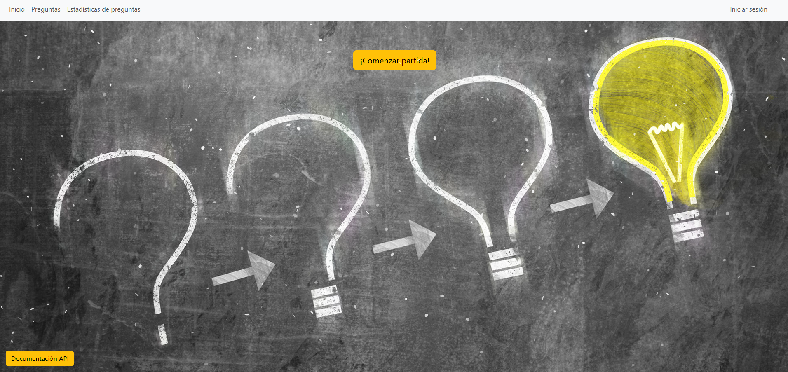
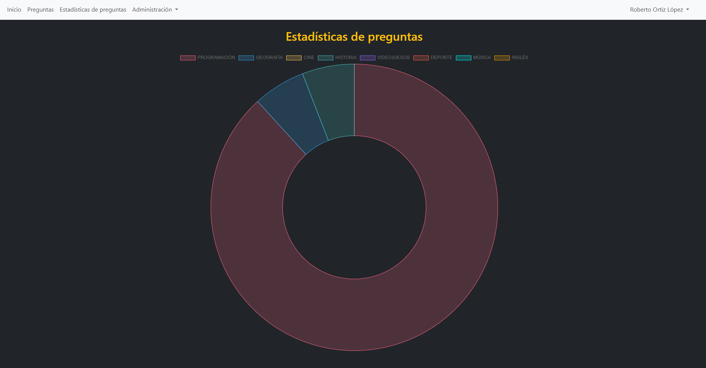
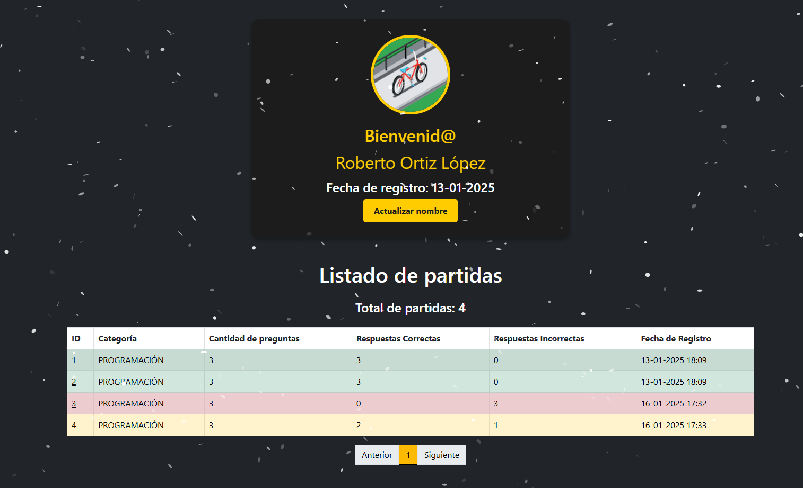
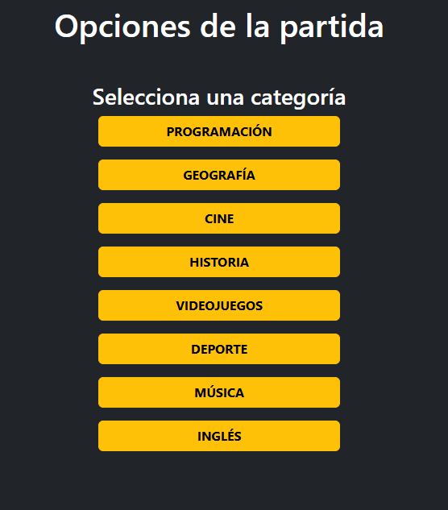
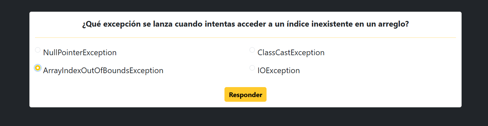
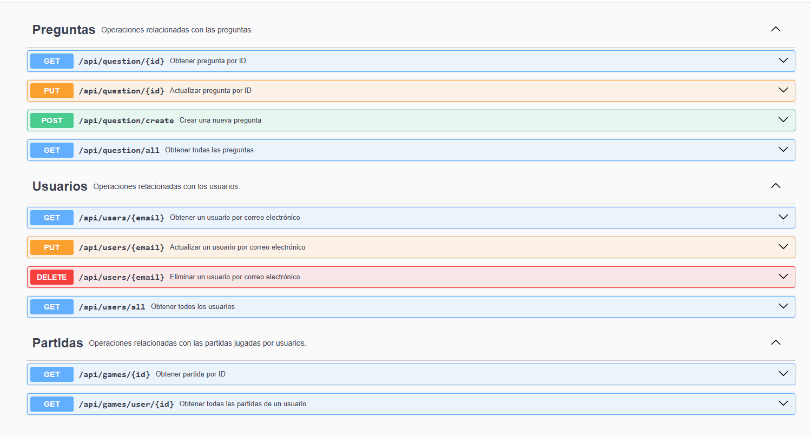

# QUESTION APP

Question app es un proyecto propio encargado en clase para realizar durante el periodo de vacaciones de Navidad. A continuación se muestran tanto los requisitos como las cosas extras incluidas para mejorar el proyecto.

## Requisitos
Los requisitos puntuables para la entrega son los siguientes:

* Implementación de una Base de datos: H2 o MySQL. (`MySQL` fué mi elección).

* Creación de una página de inicio como punto de entrada a la aplicación.

* Utilización de archivos estáticos para almacenar y servir recursos (CSS, JavaScript, imágenes ...).

* Utilización de fragmentos de Thymeleaf para no repetir código común.

* Navegabilidad completa por la aplicación sin necesidad de introducir rutas manuales.

* CRUD completo de preguntas del tipo verdadero / falso.

* CRUD completo de preguntas con una única respuesta correcta.

* CRUD completo de preguntas con más de una respuesta correcta.

* Posibilidad de poder contenstar y validar las preguntas.

* Aplicar herencia con las preguntas.

* Subir preguntas desde un archivo (en mi caso seleccione el tipo de archivo `JSON`).

* Mantenimiento de todos los tipos de pregunta, con opciones para editar, listar o filtrar por categoría de preguntas.

* Implementación funcional de cualquier API (decidí elegir `Google OAuth2`).

* Desarrollo de API REST para proporcionar funcionalidades para las operaciones GET, POST, PUT y DELETE.

* Documentación de API REST con `Swagger`.

* Gestión de errores 404 y 500 con páginas personalizadas.

* Crear listado páginado para las listas que se muestren en la aplicación.

## Extras
Para seguir practicando decidí incluir algunos extras de las cosas que se me iban ocurriendo.

* Nieve cayendo en el home utilizando librerias JS.

* Al terminar de contestar la cantidad de preguntas seleccionadas, aparece confetti mendiante la librería `Canvas Confetti`.

* Creación de una gráfica para mostrar la cantidad de preguntas según la categoría. En este caso utilice el elemento `Doughnut` de la famosa librería `Chart.js`.

* Al utilizar la API de autenticación de Google, incluí `Spring Security` y definí unas políticas de seguridad para diferenciar entre usuarios no logueados, usuarios logueados sin permisos y usuarios logueados con permiso de administración.

* Disponibilidad de login y logout en la aplicación, limpiando cookies del navegador.

* Creación un perfil de usuario donde mostraba la información de su cuenta de Google (nombre, correo electrónico e imágen de perfil). El nombre puede ser editado desde el perfil.

* Aprovechando que tenía usuarios y un perfil, decidí guardar un registro de las partidas jugadas. En cada partida se recoge tanto las preguntas que han entrado con sus respectivas respuestas correctas e incorrectas como la respuesta que el usuario seleccionó. También se almacena la hora de la partida.

* El historial de partidas tiene un sistema de colores en el cual si la partida no contiene errores será representada en la lista de color verde. Si tiene más errores que aciertos, se representa de color rojo. Para el resto de casos, se representa de color naranja.

* Se incluye un sistema de aviso como información en una partida para avisar de posibles modificaciones sobre alguna pregunta o incluso avisar si alguna pregunta actualmente ha sido desactivada y no se encuentra de forma activa en la aplicación.

* Implementación de un sistema para poder escalar privilegios. Un usuario logueado pero no administrador, puede cambiar su rol si introduce correctamente una contraseña en el apartado correspondiente. Dicha contraseña se encuentra en memoria en el programa, para mayor seguridad, la contraseña está encriptada utilizando `PasswordEncoder`.

* Incluida fecha de registro del usuario en la aplicación.

## Imágenes de la aplicación

